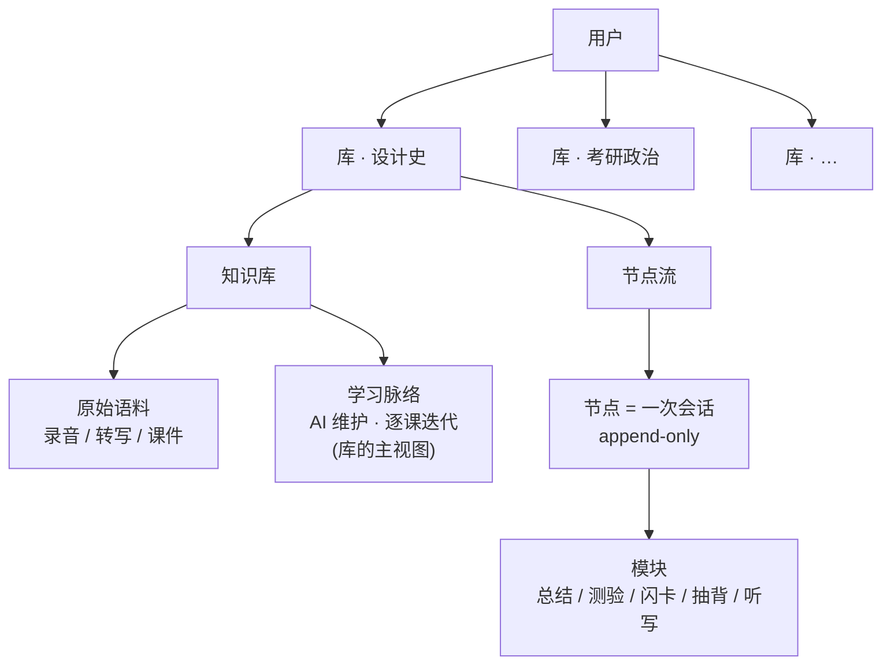
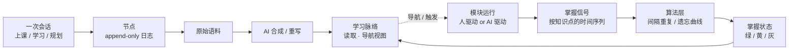
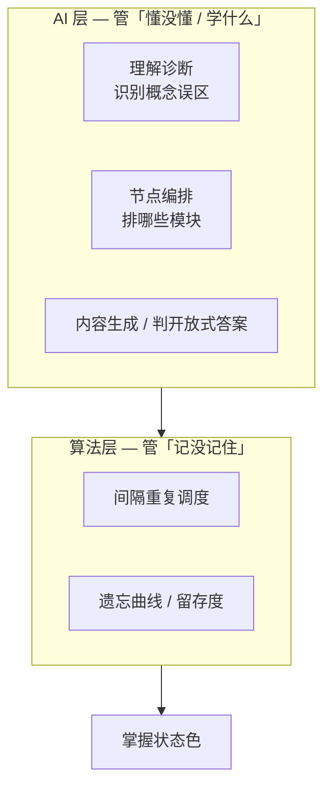
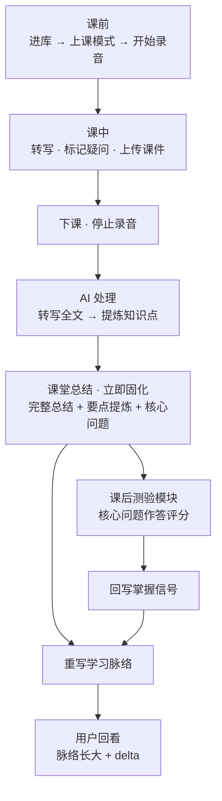
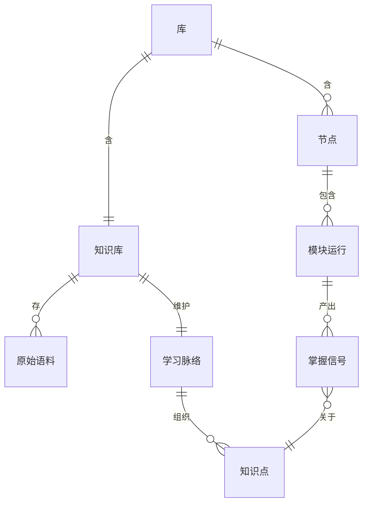

# 产品架构图

## 文档定位

本文是 Zlzl 的**产品 / 信息架构**图,描述库、知识库、脉络、节点、模块、
信号之间的结构与数据流。

不是部署 / 技术拓扑(ASR 选型、是否需要后端等仍待定,见
[concept.md](concept.md) 第 12 节)。完整设计理由见 [concept.md](concept.md)。

---

## 1. 信息架构总览

用户拥有多个库;每个库是一条学习路径,内部分知识库与节点流。

要点:节点是**生产单元**,导航靠学习脉络,不靠浏览节点。

---

## 2. 双视图与信号闭环

写入路径(活动轴)与读取路径(内容轴)是同一份数据的两个视图。
模块运行产出掌握信号,经算法层得到掌握状态,回流脉络。

要点:回写**与驱动方无关**;固化的只有信号,不是题目。

---

## 3. 分层职责:算法层 vs AI 层

要点:AI 不做记忆调度;算法不做理解诊断。MVP 只用简单状态规则,
算法层(FSRS / SM-2)是 v2。

---

## 4. 上课模式 MVP 主线流程

要点:`核心问题`(陈述)与`测验`(作答)是同一内容的两个激活层;
课堂总结 eager 固化,测验信号回写后驱动脉络重写。

---

## 5. 数据实体关系(MVP 视角)

要点:`掌握信号` 以"按知识点的时间序列"存储,是 v2 接入 SRS 算法
的基础,MVP 阶段即按此结构落库,避免后续迁移。
