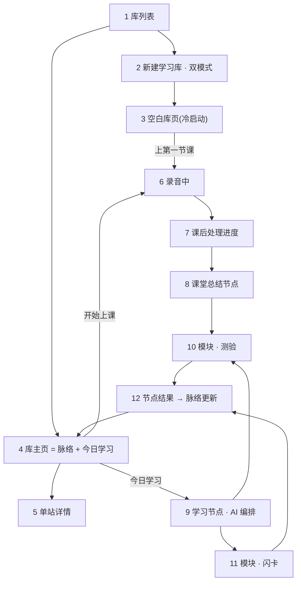

# 原型 · 结构索引

## 文档定位

本文是 Zlzl **MVP(上课模式 + 学习模式)** 原型的**结构索引**:屏幕清单、
屏幕流、每屏一行行为说明。

> **可视化原型见同目录 [prototype.html](prototype.html)** —— 用浏览器打开,
> 12 屏带配色 / 组件的手机框视觉稿,是原型的**视觉事实来源**。
> 产品结构总览见 [structure.html](structure.html)(给团队讲产品用)。
> 本文只保留结构,避免与 .html 出现口径漂移。

产品依据见 [concept.md](concept.md),架构见 [architecture.md](architecture.md)。

导航原则:遵循"少选择",一级入口仅"学习库 / 我的",主要操作在库内下钻。

## 屏幕流

## 屏幕清单

| # | 屏幕 | 一行说明 |
|---|---|---|
| 1 | 库列表 / 首页 | 库卡片用掌握分布微条(绿/黄/灰);含只读 demo 库 |
| 2 | 新建学习库 · 双模式 | 课程学习 / 自主学习二选一 + 库名 + 多模态资料;MVP 专注课程学习,自主学习占位 |
| 3 | 空白库页(课程学习 · 冷启动) | 新建库后首屏;淡化预览传达"脉络会长大" |
| 4 | 库主页 = 学习脉络 + 今日学习 | 生长路径 + 本次更新 delta + 学伴便签;双入口:今日学习 / 开始上课 |
| 5 | 脉络单站详情 | 点路径站点进入;知识提炼 + 你的状态 |
| 6 | 上课模式 · 录音中 | 极简录音页,不在课中推转写流;前台连续录 + 自动分段 |
| 7 | 课后处理进度 | 异步流水线状态轮询;强调"接进脉络" |
| 8 | 课堂总结节点 | 三段式(完整总结/要点提炼/核心问题)+ 完整转写稿入口;立即固化,带纠错入口 |
| 9 | 学习节点 · AI 编排视图 | 长期规划的可见界面:排了哪些知识点、为什么(解疑/到期复习) |
| 10 | 模块 · 测验 | 上课线 / 学习线共用;语音作答优先 + 文字作答;题目来自核心问题 |
| 11 | 模块 · 闪卡 | 翻卡 + 自评;自评回写记忆强度信号 |
| 12 | 节点结果 → 脉络更新 | 上课 / 学习通用;信号回写 → 状态色更新 → 脉络 delta |

屏 4 的「今日学习」卡 + 屏 9,是长期规划在 MVP 里唯一可见的两个界面。

## 待与用户确认 / 后续打磨

- 一级导航是否只保留"学习库 / 我的"两个 tab。
- "本次更新"与学伴便签的口吻文案尺度。
- **纯自主学习模式**(自主学习库)的交互需单独重新设计——目前学习节点
  "完全被 AI 安排"对上课模式 MVP 够用,但自主学习场景待后续讨论(已标记)。
- 实时转写 + 课中 AI 旁注的呈现形式(后续增强,MVP 不做)。
- 配色 / 品牌 / 吉祥物(小知)为初版,可调。
